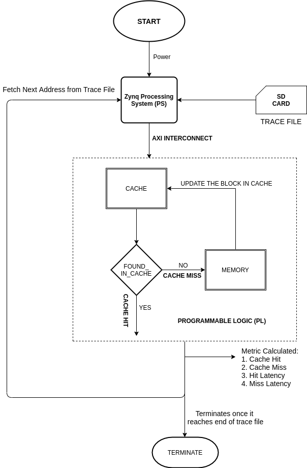

# FPGA Accelerated Cache Simulator
Designing Parameterized cache simulator with complete hierarchy of cache memory in single core processor and then extending to multi core processors on FPGA.

I/O of Simulator:
Input: Configuration File and Trace File
Output: Hit and Miss Metric and Latency Metric dumped in file

Board used: Zedboard - Zynq Architecture 
PL - Cache Architecture
PS - To send the Input files and receive the Output file

**Block Diagram:**

**Flow Chart:**

